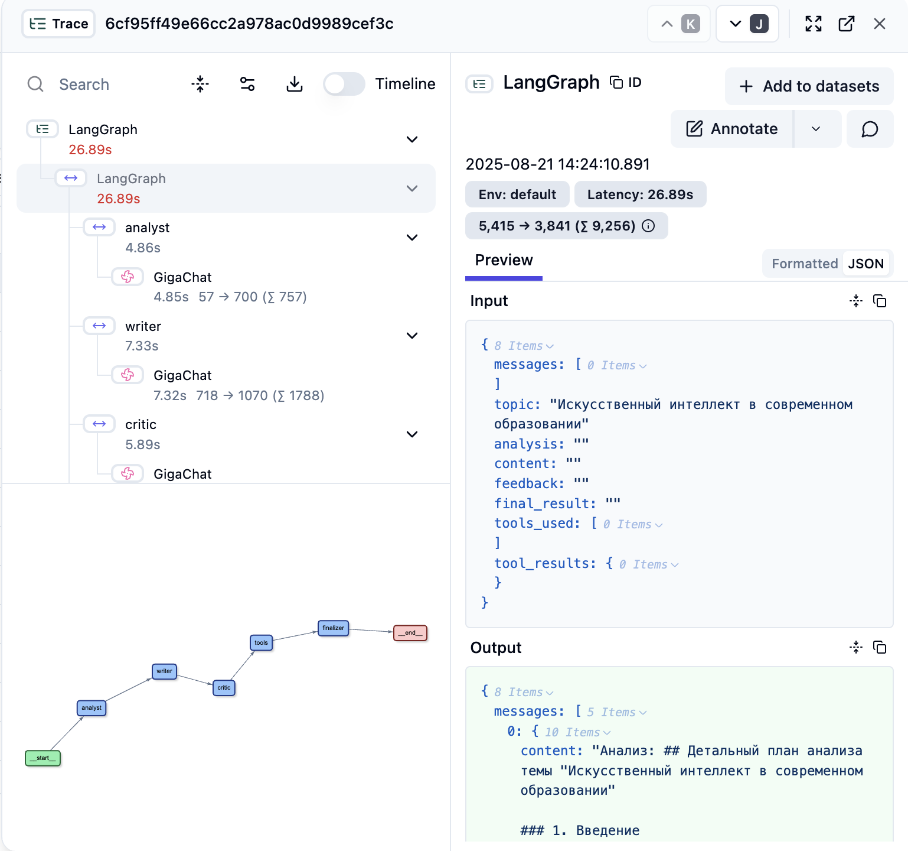

# 🤖 Мультиагентная система с LangGraph и GigaChat

Современная мультиагентная система для создания качественного контента с использованием LangGraph, GigaChat и Langfuse для мониторинга.

## 🎯 Описание

Эта система представляет собой интеллектуальную платформу, которая использует несколько специализированных AI-агентов для создания, анализа и улучшения контента. Каждый агент выполняет свою уникальную роль в процессе создания качественного материала.

## 🏗️ Архитектура системы

### Агенты

1. **📊 Аналитик** - анализирует тему и создает детальный план работы
2. **✍️ Писатель** - создает контент на основе анализа
3. **🔍 Критик** - оценивает и предлагает улучшения
4. **🔧 Инструментарий** - обогащает контент дополнительной информацией
5. **🎯 Финализатор** - создает итоговую версию

### Инструменты

- **🕐 get_current_time** - получение текущего времени
- **📝 calculate_word_count** - подсчет слов в тексте
- **😊 analyze_sentiment** - анализ эмоциональной окраски
- **📋 generate_summary** - создание краткого резюме
- **🌤️ get_weather_info** - информация о погоде

## 🚀 Быстрый старт

### Предварительные требования

- Python 3.8+
- Виртуальное окружение
- API ключ GigaChat

### Что вы получите

После настройки вы сможете:
- 🎯 Создавать качественный контент с помощью AI-агентов
- 📊 Мониторить производительность через Langfuse
- 🔄 Сохранять и восстанавливать сессии работы
- 🛠️ Использовать различные инструменты для обогащения контента



*Мониторинг выполнения агентов в реальном времени*

### Установка

1. **Клонируйте репозиторий**
```bash
git clone <repository-url>
cd AI-Agent
```

2. **Создайте виртуальное окружение**
```bash
python -m venv venv
source venv/bin/activate  # Linux/Mac
# или
venv\Scripts\activate  # Windows
```

3. **Установите зависимости**
```bash
pip install -r requirements.txt
```

4. **Настройте Langfuse (опционально)**
Для мониторинга системы рекомендуется установить Langfuse:

**Вариант А: Self-hosted развертывание**
```bash
# Клонируйте репозиторий Langfuse
git clone https://github.com/langfuse/langfuse.git
cd langfuse

# Запустите с помощью Docker Compose
docker compose up

# Откройте http://localhost:3000 и создайте проект
# Скопируйте API ключи из настроек проекта
```

**Вариант Б: Облачная версия**
- Зарегистрируйтесь на https://cloud.langfuse.com
- Создайте новый проект
- Скопируйте API ключи

5. **Настройте переменные окружения**
Создайте файл `config.env`:
```env
# GigaChat API credentials
GIGACHAT_API_KEY=your_gigachat_api_key_here

# Langfuse monitoring configuration (опционально)
LANGFUSE_PUBLIC_KEY=your_langfuse_public_key
LANGFUSE_SECRET_KEY=your_langfuse_secret_key
LANGFUSE_HOST=http://localhost:3000
```

6. **Запустите систему**
```bash
python agents.py
```

## 📋 Использование

### Автоматический режим
Система автоматически выполнит полный цикл обработки:
```bash
python agents.py
# Выберите: 1
```

### Интерактивный режим
Возможность вмешательства на каждом этапе:
```bash
python agents.py
# Выберите: 2
```

### Восстановление сессии
Продолжение прерванной работы:
```bash
python agents.py
# Выберите: 3
# Введите Thread ID: session_20250821_140830
```

## 🔧 Программное использование

### Базовое использование
```python
from agents import run_multi_agent_system

# Автоматический запуск
result = run_multi_agent_system("Искусственный интеллект в образовании")

print("Анализ:", result["analysis"])
print("Контент:", result["content"])
print("Критика:", result["feedback"])
print("Финальный результат:", result["final_result"])
```

### Интерактивное использование
```python
from agents import run_interactive_system

# Интерактивный режим с возможностью редактирования
result = run_interactive_system("Моя тема")
```

### Восстановление сессии
```python
# Продолжение с сохраненного состояния
result = run_multi_agent_system(
    "Моя тема", 
    thread_id="session_20250821_140830"
)
```

## 🏛️ Структура проекта

```
AI-Agent/
├── agents.py              # Основная система агентов
├── config.env             # Конфигурация переменных окружения
├── requirements.txt       # Зависимости Python
├── README.md             # Документация
├── LANGFUSE_SETUP.md     # Подробное руководство по Langfuse
├── langfuse.png          # Скриншот примера трассировки
├── .vscode/              # Настройки VS Code
│   └── settings.json
└── venv/                 # Виртуальное окружение
```

## 🔍 Мониторинг и аналитика

### Langfuse интеграция

#### Быстрое развертывание Langfuse
```bash
# 1. Клонируйте репозиторий
git clone https://github.com/langfuse/langfuse.git
cd langfuse

# 2. Запустите с Docker Compose
docker compose up

# 3. Откройте браузер: http://localhost:3000
# 4. Создайте аккаунт и проект
# 5. Скопируйте API ключи в config.env
```

#### Что мониторит Langfuse
Система автоматически отправляет данные для:
- **Производительность агентов** - время выполнения каждого агента
- **Использование LLM** - количество токенов, стоимость запросов
- **Трассировка выполнения** - полный путь обработки задачи
- **Отладка и оптимизация** - анализ ошибок и узких мест

#### Доступ к дашборду
После запуска Langfuse:
1. Откройте http://localhost:3000
2. Войдите в систему
3. Перейдите в раздел "Traces"
4. Анализируйте выполнение агентов


*Пример трассировки выполнения мультиагентной системы в Langfuse*

#### Альтернативы
- **Облачная версия**: https://cloud.langfuse.com
- **Без мониторинга**: система работает и без Langfuse

📖 **Подробное руководство**: См. [LANGFUSE_SETUP.md](LANGFUSE_SETUP.md) для детальной настройки и использования

### Локальная отладка
```bash
# Включение отладочной информации
export DEBUG=1
python agents.py
```

## 🛠️ Настройка и кастомизация

### Добавление новых агентов
```python
def create_custom_agent():
    """Создание нового агента"""
    def custom_agent(state: AgentState) -> AgentState:
        # Логика агента
        return state
    return custom_agent

# Добавление в граф
workflow.add_node("custom", create_custom_agent())
workflow.add_edge("previous_agent", "custom")
```

### Добавление новых инструментов
```python
@tool
def custom_tool(param: str) -> str:
    """Описание инструмента"""
    return f"Результат: {param}"

# Добавление в список доступных инструментов
available_tools.append(custom_tool)
```

### Настройка промптов
```python
prompt = ChatPromptTemplate.from_messages([
    ("system", "Ваш кастомный системный промпт"),
    ("user", "Ваш пользовательский промпт: {variable}")
])
```

## 📊 Примеры вывода

### Результат работы системы
```
🚀 Запуск мультиагентной системы...
📝 Тема: Искусственный интеллект в современном образовании

📊 АНАЛИЗ:
## Детальный план анализа темы...

✍️ КОНТЕНТ:
# Искусственный Интеллект в Современном Образовании...

🔍 КРИТИКА:
Ваш текст является хорошим введением в тему...

🎯 ФИНАЛЬНЫЙ РЕЗУЛЬТАТ:
# Искусственный Интеллект в Современном Образовании...

🔧 ИСПОЛЬЗОВАННЫЕ ИНСТРУМЕНТЫ:
   - get_current_time
   - calculate_word_count
   - analyze_sentiment
   - generate_summary
   - get_weather_info

📊 РЕЗУЛЬТАТЫ РАБОТЫ ИНСТРУМЕНТОВ:
   current_time: Текущее время: 2025-08-21 14:08:30
   word_count: Количество слов в тексте: 782
   sentiment: Эмоциональная окраска: Нейтральная
   weather: Погода в Moscow: 15°C, Облачно, влажность: 65%
```

## 🔧 Устранение неполадок

### Проблема: Ошибка авторизации GigaChat
```
❌ Ошибка: (URL('https://gigachat.devices.sberbank.ru/api/v1/chat/completions'), 401, b'{"status":401,"message":"Unauthorized"}')
```
**Решение:** Проверьте правильность API ключа в `config.env`

### Проблема: Переменные окружения не загружаются
```
❌ Ошибка: GIGACHAT_API_KEY не найден в переменных окружения
```
**Решение:** Убедитесь, что файл `config.env` существует и содержит правильные ключи

### Проблема: Langfuse не подключается
```
⚠️ Langfuse трассировка отключена (отсутствуют настройки)
```
**Решение:** 
1. Убедитесь, что Langfuse запущен: `docker compose up` в папке langfuse
2. Проверьте настройки в `config.env`
3. Убедитесь, что `LANGFUSE_HOST=http://localhost:3000`
4. Или запустите систему без мониторинга

### Проблема: Docker не найден
```
❌ docker: command not found
```
**Решение:** Установите Docker с официального сайта: https://docker.com/get-started

### Проблема: Редактор не видит библиотеки
```
ModuleNotFoundError: No module named 'dotenv'
```
**Решение:** Активируйте виртуальное окружение и настройте Python интерпретатор в VS Code

## 🚀 Производительность

### Оптимизация
- Используйте интерактивный режим для длительных задач
- Сохраняйте Thread ID для восстановления сессий
- Мониторьте производительность через Langfuse

### Масштабирование
- Система поддерживает параллельную обработку
- Можно добавлять новые агенты и инструменты
- Интеграция с внешними API и сервисами

## 🤝 Вклад в проект

1. Форкните репозиторий
2. Создайте ветку для новой функции
3. Внесите изменения
4. Добавьте тесты
5. Создайте Pull Request

## 📄 Лицензия

Этот проект распространяется под лицензией MIT. См. файл `LICENSE` для подробностей.

## 🆘 Поддержка

- **Документация:** 
  - `README.md` - основная документация
  - `QUICK_START.md` - быстрый старт
  - `LANGFUSE_SETUP.md` - настройка мониторинга
  - `MEMORY_SAVER_GUIDE.md` - работа с состоянием
- **Issues:** Создавайте issues в GitHub для багов и предложений
- **Discussions:** Используйте Discussions для вопросов и обсуждений

## 🔮 Планы развития

- [ ] Интеграция с RAG (Retrieval-Augmented Generation)
- [ ] Поддержка эмбедингов GigaChat
- [ ] Веб-интерфейс для управления
- [ ] API для внешних интеграций
- [ ] Поддержка множественных языков
- [ ] Расширенная аналитика и отчеты

## 📞 Контакты

- **Автор:** [Ваше имя]
- **Email:** [your.email@example.com]
- **GitHub:** [github.com/yourusername]

---

⭐ Если этот проект вам понравился, поставьте звездочку на GitHub!
